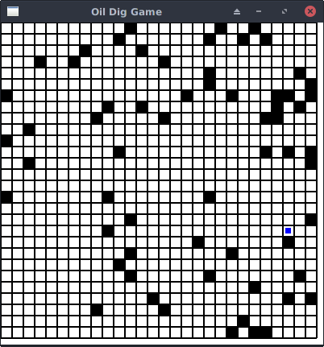

# 概要
オイル村はn×nの格子状の村で、マス目のどこからでも石油が出ることで有名です。
プレイヤーは一攫千金をねらってオイル村にやってきました。
ライバルよりも多くの石油を手にいれられるように頑張りましょう。

# アバウトなルール

・巡回セールスマン問題のように効率よく石油を集めることが必要  
・石油は何ガロンでも同時に持っていい  
・石油の場所はランダムで、時々補充される  
・プレイヤーは2~4人程度  
・爆弾による妨害要素がある(未実装)  

# 開発目標
・AIが作成しやすい  
・運要素が強くクソゲー感がある

# 通信の仕様
標準入出力を使用する。

## 入力例
```text
35 <= 盤面の大きさ
49 <= 石油マスの数
0 34 -11 <= 石油マスのx座標、y座標、量(ガロン)
2 29 17
...
0 <= 爆弾マスの数
...
2 0 <= プレイヤーの数、 自分のプレイヤーid
0 34 -11 <= プレイヤーiがいるマスのx座標、y座標、石油の量(ガロン)
```

## 出力例
改行しないとプログラムが停止するので注意。
```text
0 => 何もしない
1 2 => 下左右上 のうち 0から数えて2番目(右)に移動
2 => 爆弾をひろう
3 => 爆弾を落とす
```

# 進捗



・石油の配置とプレイヤーの移動はできた  
・デバッグモードになっており、貪欲法AIが一人で起動する(g++必須)  

# todo

爆弾、マルチスレッド、複数対戦の検証、GUI化

# 開発言語など
rust1.18.0  
ライブラリはこれ
https://github.com/PistonDevelopers/piston

# 動かす

## Linux, Mac

・https://www.rust-lang.org/ja-JP/ を見てrustをいれる  
・curl ... してRUST_SRC_PATHを設定すれば動く  
・
```text
git clone https://github.com/kngwyu/oil_dig_game.git
cd ./oil_dig_game
cargo run
```
で動く

## Windows
余裕があれば検証します

