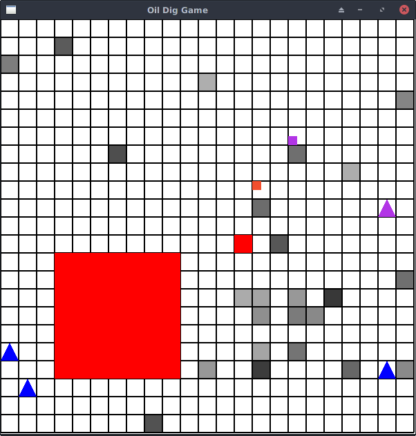

# 概要
オイル村はn×nの格子状の村で、マス目のどこからでも石油が出ることで有名です。
プレイヤーは一攫千金をねらってオイル村にやってきました。
ライバルよりも多くの石油を手にいれられるように頑張りましょう。  
ただし、うまい話には必ず裏があるものです。オイル村には悪意ある人間にさ
わられると爆弾に変化する猫(ボムキャット)が生息しています。ライバルが設
置した爆弾ねこに近づくと死んでしまうので注意して下さい。

# 暫定ルール

- 巡回セールスマン問題のように効率よく石油を集めることが必要
- 石油は何ガロンでも同時に持っていい
- 石油・爆弾の場所はランダムで、時々補充される
- プレイヤーは2~4人程度
- 以下の4通りの操作が可能
-- 0 => 何もしない
-- 1 => 移動(詳細は入力例に)
-- 2 => 爆弾をひろう
-- 3 => 爆弾を設置する
- 各プレイヤーは順番に行動する
- 爆弾は他の爆発物を誘爆しない
-- 構想段階では誘爆していたがひとまずこれで

# 開発目標
・AIが作成しやすい  
・運要素が強くクソゲー感がある

# 通信の仕様
標準入出力を使用する。

## 入力例
```text
35 <= 盤面の大きさ

2 0 <= プレイヤーの数、 自分のプレイヤーid
0 34 -11 <= プレイヤーiがいるマスのx座標、y座標、石油の量(ガロン)
...

49 <= 石油マスの数
0 34 -11 <= 石油マスのx座標、y座標、量(ガロン)
2 29 17
...

5 <= 爆弾マスの数
12 8 1 <= 爆弾のx座標、y座標、爆弾の設置者(いないなら-1)
3 23 -1
...
```

## 出力例
改行しないとプログラムが停止するので注意。
```text
0 => 何もしない
1 2 => 下左右上 のうち 0から数えて2番目(右)に移動
2 => 爆弾をひろう
3 => 爆弾を落とす
```

# 進捗



- 一応爆弾が実装できたが、バグっているかもしれない
- 爆弾AIを追加したがクソゲー臭がひどい 
- pを押すとポーズする

# todo
issueに移動

# 開発言語など
rust1.18.0  
ライブラリはこれ
https://github.com/PistonDevelopers/piston

# 動かす

## Linux, Mac

- https://www.rust-lang.org/ja-JP/ を見てrustをいれる
- デフォルトで$HOME以下にインストールされるので管理者権限は不要(= ECCSでも問題ない)
- curl ... してPATHに~/.cargo/binを設定すればrustは動く
- ゲーム本体は
```text
git clone https://github.com/kngwyu/oil_dig_game.git
cd ./oil_dig_game
cargo run
```
で動く

- 更新は
```text
git pull
```

## Windows
余裕があれば検証します

# サンプルAI

現在player_ai/sample.ccのみ。
 そのうちruby版も追加します。